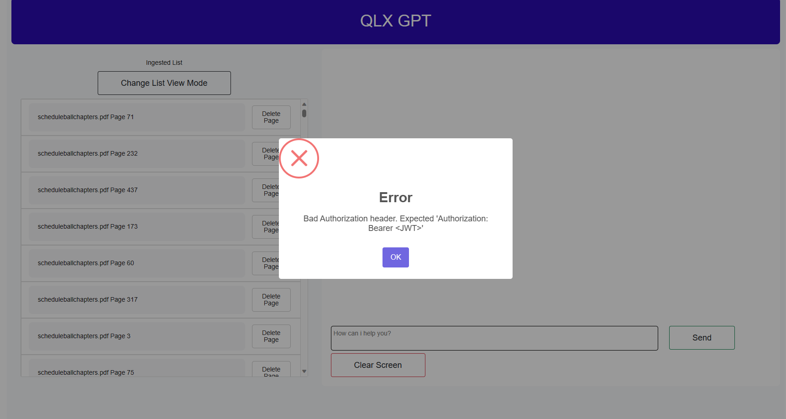
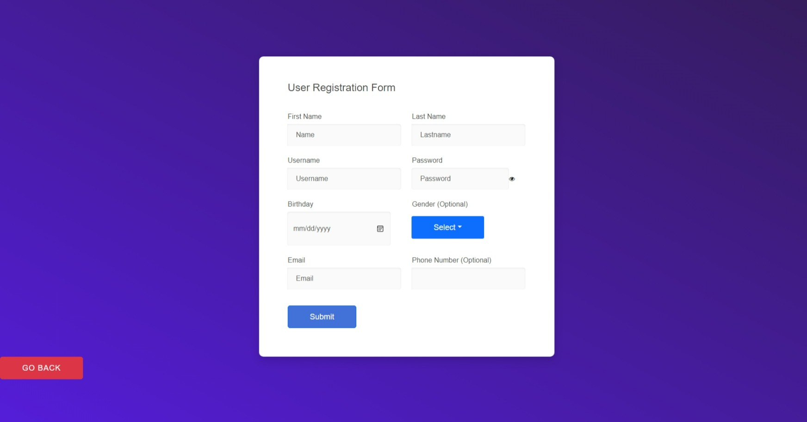
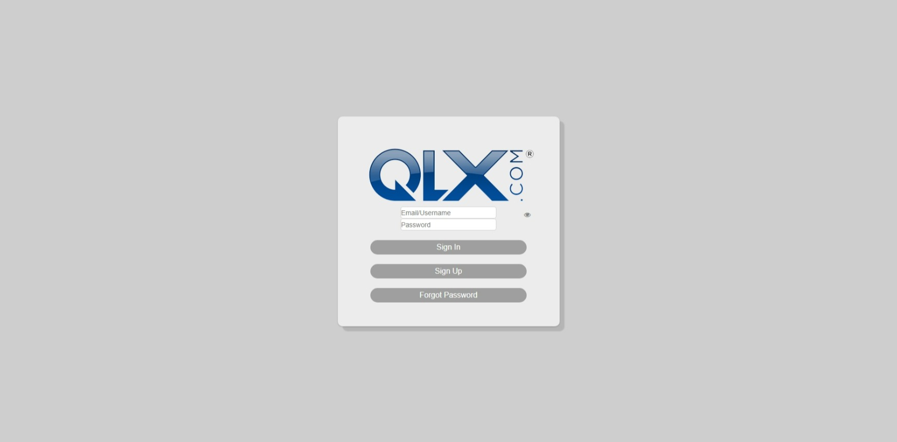
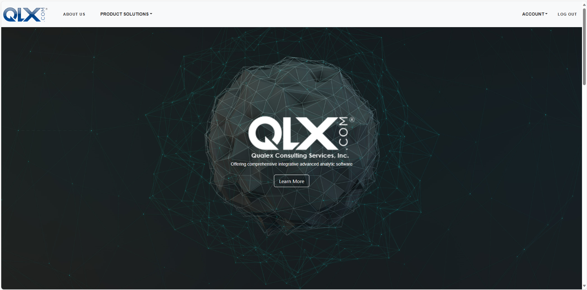
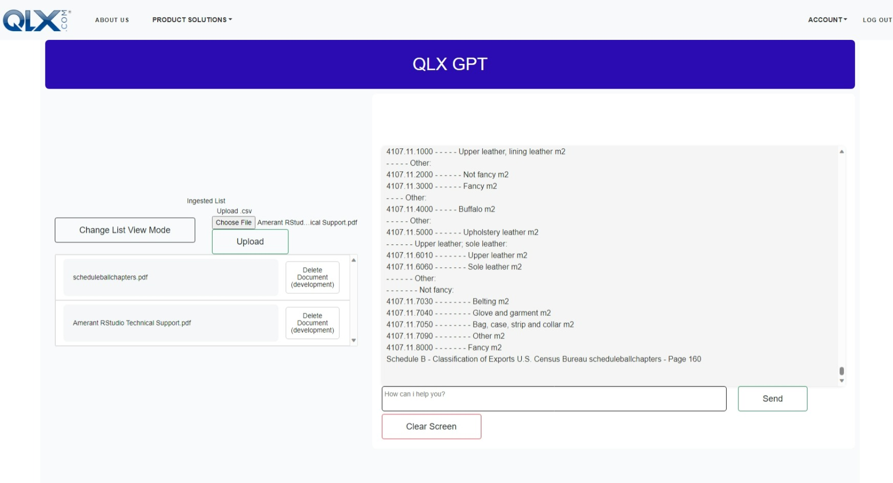

# Readme

Here you will find some documentation of the Front-end.

## Index

- [Environment: ](#environment)
    - - [Environment explanation for front-end](#explanation)
- [Web UI: ](#web-ui)
    - - [React](#react)
    - - [Folder Structure](#folder-structure)
    - - [Test without login](#test-without-login)
    - - [Signup](#signup)
    - - [Login](#login)
    - - [Landing](#landing)
    - - [IQ-GPT](#iq-gpt)
    

## Environment

### Explanation
In the .env file you should find the following structure:

```python
#Front-end variables:
## URL to main backend:
BASE_URL2 = "http://localhost:3341"
## URL to main frontend (you should use the IP of the frontend server instead of localhost to be reached from outside):
BASE_URL_PUBLIC = "localhost:3002"
## URL to LLM:
IA_URL = "http://localhost:3341"
##Numbers of lines ver table:
LINEAS_PAGINA = "10"
```

- BASE_URL2 makes reference to main API, that will manage the access to the DB and user authentication.
- IA_URL makes reference to the API that will manage the embeddings and LLM, in case that you want to have both API working as one, the url should be the same.
- BASE_URL_PUBLIC makes reference for main url of the front-end server side. It could be with a port, or without a port if you are going to use the ports 80 for `http` and 443 for `https`. In this case, you should change port at `package.json` and `webpack.dev.js` files

## Web UI

### React

The framework for the front-end is React.

React is a library for javascript that creates Single Application Pages (SAP) for web. This means that web apps based on React are actually a single web page that simulate the navigation through the app. Some of the pages of the web app could be a protected view, thanks to a High Order Component (HOC), that means that if you want to access directly from the browser to a page like `http://localhost:3002/qlx-account/security/credit-cards/` you will be redirect to BASE PAGE. The same will happen if you are already inside of a protected view and you try to reload the page from the browser.

Note: That HOC is just an extra layer of security, but the main security should be in the backed when you are protecting the endpoints.

React make use of the components, that means that the whole page doesn't need to be reloaded every time that you navigate through the web app, only the views or components that needs to change will change.

### Folder Structure

The folder structure for the React is the following:

```css
Project
│   .env
│   package.json
│   webpack.common.js
│   webpack.dev.js
│   webpack.prod.js
│   template.html
│   icon.ico
│   .eslintrc
│   .gitignore
│
└───src
│   │
│   ├───js
│   │   │   index.js
│   │   │   layout.js
│   │   │
│   │   │───assets
│   │   │
│   │   │───components
│   │   │   │   scrollToTop.js
│   │   │   │   
│   │   │   │───Auth
│   │   │   │   │   withAuth.js (HOC)
│   │   │   │───Navbar2
│   │   │   │   │   navbar.css
│   │   │   │   │   navbar.jsx 
│   │   │    
│   │   │───store
│   │   │   │   appContext.js      
│   │   │   │   flux.js
│   │   │   │   users.js
│   │   │   │   archivo.js
│   │   │   
│   │   │───views
│   │   │   │   homeView.js
│   │   │   │    
│   │   │   │───404
│   │   │   │   │   404.jsx
│   │   │   │   │   404.css
│   │   │   │ 
│   │   │   │───IQGPT
│   │   │   │   │   index.jsx
│   │   │   │   │   index.module.css
│   │   │   │   │   groupFiles.jsx
│   │   │   │   │   listFiles.jsx
│   │   │   │   │   prompt.jsx
│   │   │   │ 
│   │   │   │───Landing
│   │   │   │   │   ...
│   │   │   │ 
│   │   │   │───Login
│   │   │   │   │   login.jsx
│   │   │   │   │   login.module.css
│   │   │   │   │   signup.jsx
│   │   │   │   │   signup.css
│   │
│   │───img
│   │   │   logo.png
│   │   │   ...
│   │      
│   ├───styles
│   │   │   index.css
│   │   │   ...
│
└───docs
   

```


### Test without login

To test without making login (basically without setup the database) go to:
[http://localhost:3002/iq-gpt-develop](http://localhost:3002/iq-gpt-develop)

Just be aware that some endpoints in backend are protected, so, without doing login first some actions will be restricted, as delete a document:



### Signup

Actually, If backend user's route is checked (and models too), we are only storing the email and password.



If signup has been going well, the you'll see the email and password hashed in the database view [http://localhost:3341/admin/user/](http://localhost:3341/admin/user/)


### Login

As we are only saving email and password in backend, we have to login with these.



### Landing

We'll see the landing and the navbar.



### IQ-GPT

Navigate to it through the navbar. This is a protected view.

In this view you will be able to obtain the most important chunks given a description, and delete ingested documents.

