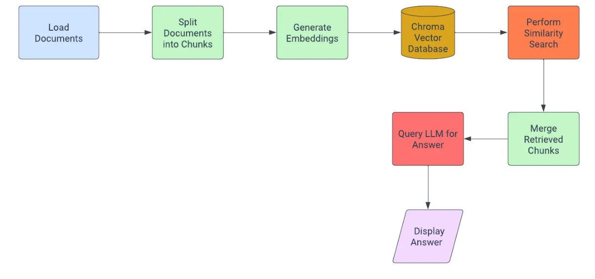
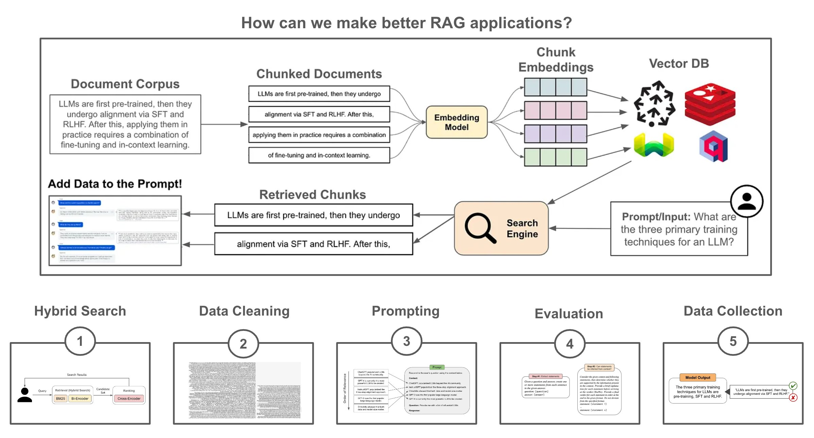

# Theory

## Index

- [Introduction](#introduction)
- [Background](#background)
- [LangChain](#LangChain)
    - - [Example of similarity seach](#example-of-similarity-seach)
- [RAG](#rag)
    - - [Simple implementation](#simple-implementation)
    - - [Fallback Mechanisms](#fallback-mechanisms)
- [Basic code knowledge](#basic-code-knowledge)
    - - [Import necessary libraries and modules](#import-necessary-libraries-and-modules)
    - - [Initialize embedding](#initialize-embedding)
    - - [Embedding](#embedding)
    - - [Perform query and test with interface chat](#perform-query-and-test-with-interface-chat)
- [Conclusion](#conclusion)


## Introduction

Generative AI is becoming all the rage nowadays. ChatGPT has played a significant role in this trend, with over a million users leveraging its capabilities. However, while ChatGPT is impressive, it lacks updates from data post-2021. This is where the LLM (Large Language Model) comes into play. Although LLMs are versatile, they aren’t inherently designed to retrieve real-time information. This limitation can be addressed by integrating them with up-to-date information retrieved during the search step.

## Background

This readme delves into how you can train your data on LLM and create a Retrieval-Augmented Generation (RAG) system using prompt engineering tools like LangChain and LLM.

## LangChain

LangChain is a Python library crafted to aid the development of applications that utilize large language models (LLMs) such as OpenAI’s GPT-3 or GPT-4. The library offers a plethora of tools to seamlessly integrate these models into applications, especially in the realms of information retrieval and question-answering systems. Here’s a breakdown of LangChain’s features:

- Embeddings: LangChain can generate text embeddings, which are vector representations that encapsulate semantic meaning. It supports various embedding models, including those from OpenAI and HuggingFace.

- Text Splitter: Considering LLMs have token limits (e.g., GPT-3’s 2048 token limit), LangChain provides tools like the RecursiveCharacterTextSplitter to divide longer texts into manageable chunks.

- Vector Stores: After generating embeddings, they need efficient storage for rapid retrieval. LangChain offers vector storage solutions such as FAISS and Chroma for this purpose.

- Document Loaders: LangChain can load documents from directories, streamlining data reading and processing.

- Vector Stores Integration: ChromaDB and Qdrant are a vector databases optimized for storing and retrieving embeddings. LangChain supports both.

- Similarity Search: At its core, similarity search is about finding the most similar items to a given item. In the context of text, this often involves comparing vector representations of the text. One common measure used is cosine similarity, it performs cosine similarity. Basically is compare the projection of one vector on another. Given two vectors, A and B:

```
    Similarity(A, B) = cos(⌀) = ( A . B ) / ( ||A|| ||B|| )
```

### Example of similarity seach:

Suppose a user submits the query “How does photosynthesis work?”. The system would:

- Convert this query into a vector, say Q.
- Compare Q with the vectors of all documents in the database using the cosine similarity formula.
- Retrieve the top N documents with the highest similarity scores.
- Merge these documents to form a comprehensive context.
- Use this context to construct a prompt and send it to the model for a response.

## RAG

RAG, short for Retrieval-Augmented Generation, is a system that combines the power of search functions with the generation capabilities of language models. Rather than just depending on the existing knowledge of a pre-trained LLM, RAG actively pulls pertinent sections from a designated dataset to formulate answers. At the highest level, RAG is a combination of a pretrained LLM with an external (searchable) knowledge base. At inference time, we can search for relevant textual context within this knowledge base and add it to the LLM’s prompt. Then, the LLM can use its in context learning abilities to leverage this added context and produce a more factual/grounded output.

### Simple implementation

We can create a minimal RAG pipeline using a pretrained embedding model and LLM by:

1. Separating the knowledge base into fixed-size chunks.
2. Vectorizing each chunk with an embedding model.
3. Vectorizing the input/query at inference time and using vector search to find relevant chunks.
4. Adding relevant chunks into the LLM’s prompt.

A subsequent diagram provides a visual depiction of how RAG functions:



This simple approach works, but building a high-performing RAG application requires much more. Here are five avenues we can follow to refine our RAG pipeline.

1. Hybrid Search: At the end of the day, the retrieval component of RAG is just a search engine. So, we can drastically improve retrieval by using ideas from search. For example, we can perform both lexical and vector retrieval (i.e., hybrid retrieval), as well as re-ranking via a cross-encoder to retrieve the most relevant data.

2. Cleaning the data: The data used for RAG may come from several sources with different formats (e.g., pdf, markdown and more), which could lead to artifacts (e.g., logos, icons, special symbols, and code blocks) that could confuse the LLM. We can solve this by creating a data preprocessing or cleaning pipeline (either manually or by using LLM-as-a-judge) that properly standardizes, filters, and extracts data for RAG.

3. Prompt engineering: Successfully applying RAG is not just a matter of retrieving the correct context—prompt engineering plays a massive role. Once we have the relevant data, we must craft a prompt that i) includes this context and ii) formats it in a way that elicits a grounded output from the LLM. First, we need an LLM with a sufficiently large context window. Then, we can adopt strategies like diversity and lost-in-the-middle selection to ensure the context is properly incorporated into the prompt.

4. Evaluation: We must also implement repeatable and accurate evaluation pipelines for RAG that capture the performance of the whole system, as well as its individual components. We can evaluate the retrieval pipeline using typical search metrics (DCG and nDCG), while the generation component of RAG can be evaluated with an LLM-as-a-judge approach. To evaluate the full RAG pipeline, we can also leverage systems like RAGAS.

5. Data collection: As soon as we deploy our RAG application, we should begin collecting data that can be used to improve the application. For example, we can finetune retrieval models over pairs of input queries with relevant textual chunks, finetune the LLM over high-quality outputs, or even run AB tests to quantitatively measure if changes to our RAG pipeline benefit performance.

### Fallback Mechanisms

Fallback mechanisms activate when the primary system doesn’t produce a satisfactory response. These mechanisms ensure that the user receives some form of feedback, even if it’s not from the primary response generator.

#### Example of Similarity Thresholds

Suppose we set a similarity threshold of 0.8 for our system. This means that if the highest cosine similarity score for a user’s query is below 0.8, the system recognizes that it might not have a highly relevant document for the query.

In such cases, the system can:

- Provide a generic response like “I’m sorry, I couldn’t find a highly relevant answer to your question. Can you provide more details or try rephrasing?”
- Suggest related topics or questions that the system has high confidence in answering.

#### Example of Language-Based Fallbacks

If the system detects a language other than English (using a tool like langdetect), it might activate a fallback mechanism since the primary system is optimized for English queries.

In this scenario, the system could:

-Politely inform the user: “I’m optimized for English queries. Please submit your question in English for the best response.”
-If the system has multi-language support, it could try to translate the query to English and then process it. However, it should inform the user: “I’ve attempted to translate and process your query. Here’s the best response I could generate…”

## Basic code knowledge

Note that this will difer from repository code, because repository have been improved to work as an API with OpenAI format in case that eventually want to use ChatGPT instead of local LLM, and to use local vector stores. Note too, that our API is using Flask instead of Gradio or FastAPI, that's because compability to use an ORM as flask-sqlalchemy in order to work with a relational database. 

The following code, take it as basic knowledge of how it works.

### Import necessary libraries and modules

```python
import os
import requests
from langchain.text_splitter import RecursiveCharacterTextSplitter
from langchain.embeddings import OpenAIEmbeddings, HuggingFaceEmbeddings
from langchain.vectorstores import FAISS, Chroma
from langchain.document_loaders import DirectoryLoader
import chromadb

export HUGGINGFACEHUB_API_TOKEN="your_actual_token_here"

HUGGINGFACEHUB_API_TOKEN = os.environ.get("HUGGINGFACEHUB_API_TOKEN")
if not HUGGINGFACEHUB_API_TOKEN:
    raise ValueError("HUGGINGFACEHUB_API_TOKEN is not set in the environment variables.")
```

In this script, we’re leveraging a mix of libraries to enhance our text processing capabilities. We start by importing `requests` to handle web interactions. The spotlight, however, is on the `langchain` library, a specialized toolkit for working with large language models. It offers tools for text splitting, generating numerical representations of text (embeddings), efficient storage solutions for these embeddings, and utilities to load documents. Additionally, we're setting up an environment variable for authentication with the HuggingFace platform, ensuring secure access to its features.

### Initialize embedding

Inside this function, we’ve chosen the `sentence-transformers/all-mpnet-base-v2` model as our go-to model for generating embeddings. This model is known for its efficiency in converting sentences into numerical vectors while preserving their semantic meaning. By calling the HuggingFaceEmbeddings with our chosen model, we're essentially preparing our system to convert any input text into a format suitable for machine learning tasks. The confirmation message ">>>Embeddings setup completed successfully<<<" assures us that our setup is ready to roll!

```python
def initialize_embeddings():
    model_identifier = "sentence-transformers/all-mpnet-base-v2"
    print(">>>Embeddings setup completed successfully<<<")
    return HuggingFaceEmbeddings(model_name=model_identifier)
```

### Embedding

The `process_and_embed_docs` function is a crucial step in the RAG (Retrieval-Augmented Generation) process. It begins by dividing extensive text documents into smaller segments, ensuring that the content is digestible for the subsequent steps. These segments are then converted into numerical vectors, known as "embeddings", using a provided model. These embeddings encapsulate the semantic essence of the text, making them invaluable for RAG's retrieval mechanism. Once generated, the embeddings are stored in a Chroma database, setting the stage for efficient and rapid information retrieval during the question-answering phase.

```python
def process_and_embed_docs(dir_path, hf_model):
    chroma_instance = chromadb.Client()
    doc_loader = DirectoryLoader(dir_path)
    loaded_docs = doc_loader.load()
    splitter = RecursiveCharacterTextSplitter(chunk_size=500, chunk_overlap=0)
    split_docs = splitter.split_documents(loaded_docs)
    database = Chroma.from_documents(documents=split_docs, embedding=hf_model)
    print(">>>Embedding and chunking process completed successfully<<<")
    return database
```

The `concatenate_documents` function takes a list of documents as input. For each document in the list, it extracts the content and combines them into a single string. This unified content can be useful for tasks that require a consolidated view of multiple documents. The function also prints out messages indicating the successful completion of certain processes, namely "few-shot prompting" and "prompt engineering".

```python
def concatenate_documents(document_list):
    combined_content = "".join([doc.page_content for doc in document_list])
    print(">>>Few-shot prompting process completed successfully<<<")
    print(">>>Prompt engineering process completed successfully<<<")
    return combined_content
```

The code first sets up text embeddings with the `initialize_embeddings()` function. Then, using the `process_and_embed_docs` function, it processes and embeds a dataset from a given directory, making the data ready for advanced text operations like RAG.

```python
hf = initialize_embeddings()

# Replace the path below with the path to your dataset
example_path = r"PATH_TO_YOUR_DATASET_DIRECTORY"
db = process_and_embed_docs(example_path, hf)
```

### Perform query and test with interface chat

1. `query_llama2_EP` Function: This function sends a query to an external service (presumably a language model) to get a response based on the provided context and query. It formats the query using a specific template, sends it to the service, and then extracts the desired information from the response.

2. `process_query` Function: This function processes a user’s query. It first searches for similar documents in a database (`db`). Then, it consolidates the context from these documents and fetches a response using the `query_llama2_EP` function.

3. Gradio Interface: The code then sets up a user interface using the Gradio library. This interface allows users to input a query in a textbox, processes the query using the `process_query` function, and then displays the answer in another textbox. The interface is titled "Smart Speaker" and can be shared with others.

By running this code, users can interact with a smart speaker interface, input their questions, and receive answers based on the provided context and the capabilities of the external service.

```python
import requests

endpoint = 'YOUR_ENDPOINT_URL_HERE'

def query_llama2_EP(context, query, endpoint_url):
    # Define the template for the query
    template = f"""
    <s>[INST] <<SYS>>
    Confine your answer within the given context and do not generate the next context.
    Answer truthful answers, don't try to make up an answer.
    <</SYS>>
    Context: YOUR_CONTEXT_HERE
    The YOUR_CONTEXT_DESCRIPTION_HERE.
    Question: YOUR_QUESTION_HERE
    Answer: YOUR_ANSWER_HERE
    ***
    Context: {context}
    Question: {query}
    Answer: """
    
    print(template)
    
    # Define headers for the request
    headers = {
        'Authorization': 'YOUR_AUTHORIZATION_KEY_HERE',
        'Content-Type': 'application/json',
    }
    
    # Define configuration parameters for the request
    config = {
        "max_new_tokens": 200,
        "temperature": 0.01,
        "return_full_text": False,
        "early_stopping": False,
        "stop_sequence": "***",
        "do_sample": True,
        "top_p": 0.9,
        "num_return_sequences": 1
    }
    
    # Define the JSON data for the request
    json_data = {
        'inputs': template,
        'parameters': config
    }
    
    # Make the request to the provided endpoint
    response = requests.post(endpoint_url, headers=headers, json=json_data)
    
    # Extract the desired information from the response
    result = response.text.split("\":\"")[1].split("\"}]")[0]
    print(result)
    
    return result

query_llama2_EP(context, query, endpoint)

def process_query(query):
    retrieved_docs = db.search_similar(query)
    print(retrieved_docs)
    combined_context = concatenate_documents(retrieved_docs)
    answer = query_llama2_EP(combined_context, query)
    return answer.replace("\\n", "\n")
```

```python
import gradio as gr

alula_smart_speaker = gr.Interface(
    fn=process_query,
    inputs="textbox",
    outputs="textbox",
    title="Smart Speaker"
)

alula_smart_speaker.launch(share=True)
```

## Conclusion

While RAG provides a way to enhance the reliability of LLMs by constraining their responses based on specific documents, it’s not foolproof. On other hand, remember that a RAG is not more than another seach engine (with extra steps) that works better on documents and enable a LLM to expand the main knowledge and retrieve more accurrate answers given a prompt

